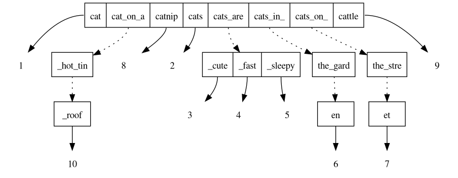

1. **编译构建**

```
sh build.sh
```

```
./
├── build
│   └── loongarch
│       ├── libmasstree.a
│       ├── masstree_mt_test
│       ├── masstree.o
│       ├── masstree_st_test
│       ├── masstree_vis
│       ├── tests_mt.o
│       ├── tests_st.o
│       ├── vis.o
│       └── vis.sh
```


2. **清空构建**

```
sh build.sh clean
```


3. **测试指令**

```
# 单线程基础测试
./masstree_st_test 

# 多线程并发测试
./masstree_mt_test

# 可视化
sh vis.sh
```

```
[root@dedsec masstree]# ./masstree_st_test 
ok
[root@dedsec masstree]# ./masstree_mt_test 
fuzz_put_del ok
fuzz_multi ok
fuzz_layers ok
all ok
```



